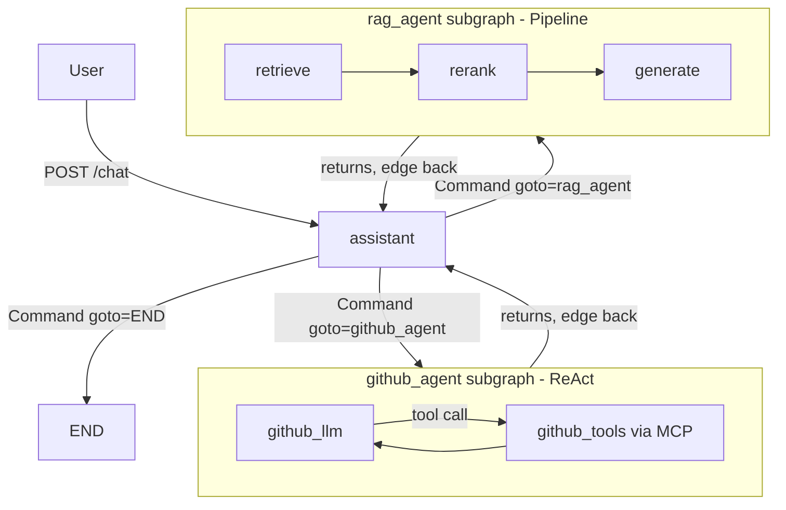

# Multi-Agent Assistant: LangGraph + Lambda + API Gateway

## Context
Building a production-quality agentic assistant that showcases LangGraph multi-agent patterns, RAG with hybrid retrieval, and MCP-based GitHub integration — all traceable via LangSmith and deployed serverlessly. Code must stay simple and whiteboard-explainable.

---

## Graph Topology (the whiteboard story)



**Three questions to answer the "why" in an interview:**
1. Why subgraphs? Each agent has its own tool loop and can be tested independently.
2. Why Command? Clean explicit routing — the supervisor "sends" work rather than using conditional edges.
3. Why interrupt()? Lets the user see the routing decision and cancel before an agent runs.

---

## File Structure

```
src/
├── state.py              # Single State shared by all nodes/subgraphs
├── config.py             # get_llm(), get_embeddings() — update existing
├── graph.py              # Wires everything together — update existing
├── api.py                # FastAPI: POST /chat, POST /chat/interrupt — new
├── lambda_handler.py     # AWS Lambda entry point (Mangum adapter) — new
├── main.py               # Local CLI — minor update
│
├── agents/
│   ├── assistant.py      # Supervisor node: routes, interrupts, synthesizes — rewrite
│   ├── github_agent.py   # ReAct subgraph via MCP tools — new
│   └── rag_agent.py      # 3-node RAG pipeline subgraph — new
│
└── rag/
    ├── ingest.py         # PDF → chunks → ChromaDB + BM25 index — new
    ├── retriever.py      # BM25 + ChromaDB + RRF fusion — new
    └── reranker.py       # Cross-encoder reranking — new

scripts/
└── ingest_resume.py      # One-time: build the ChromaDB + BM25 index — new

data/
└── resume.pdf            # Resume to ingest — user provides
```

---

## State Schema (`src/state.py` — rewrite)

```python
class State(TypedDict):
    messages: Annotated[list, add_messages]   # full conversation, shared across all nodes
    rag_context: list[dict] | None            # retrieved docs, used inside rag_agent only
    subagent_result: str | None               # last subagent's answer, for synthesis pass
    active_agent: str | None                  # "github_agent" | "rag_agent" | None
```

**Interview explanation:** State is the single source of truth passed between every node. `add_messages` is a reducer — it appends, never overwrites, so multiple nodes can safely add messages.

---

## Nodes

### `assistant` (`src/agents/assistant.py` — rewrite)

Three responsibilities, three clear code paths:

```python
# --- Embedding-based router (no LLM call, sub-10ms) ---
# Defined once at module level — prototype vectors computed at startup
PROTOTYPES = {
    "github_agent": "code repository commits pull requests issues GitHub",
    "rag_agent":    "resume experience skills education background projects",
}
_embeddings = get_embeddings()
PROTOTYPE_VECS = {k: _embeddings.embed_query(v) for k, v in PROTOTYPES.items()}

def route_query(query: str) -> tuple[str, float]:
    q_vec = _embeddings.embed_query(query)
    scores = {k: cosine_similarity([q_vec], [v])[0][0] for k, v in PROTOTYPE_VECS.items()}
    best = max(scores, key=scores.get)
    return best if scores[best] > 0.4 else "direct", scores[best]

# --- Assistant node ---
def call_assistant(state: State) -> Command:
    # Path 1: returning from a subagent → synthesize and end
    if state["subagent_result"]:
        response = llm.invoke([SystemMessage("Synthesize this subagent result into a final answer for the user: " + state["subagent_result"])] + state["messages"])
        return Command(goto=END, update={"messages": [response], "subagent_result": None})

    # Path 2: embed the latest user message and find nearest prototype
    user_message = state["messages"][-1].content
    route, score = route_query(user_message)

    # Path 3: surface decision to user and allow cancel (human-in-the-loop)
    user_response = interrupt({"route": route, "confidence": round(score, 2)})
    if user_response == "cancel":
        return Command(goto=END, update={"messages": [AIMessage("Cancelled.")]})

    if route == "direct":
        response = llm.invoke([SystemMessage("You are a helpful assistant.")] + state["messages"])
        return Command(goto=END, update={"messages": [response]})

    return Command(goto=route, update={"active_agent": route})
```

**Interview explanation:** "I embed the user's query and compare cosine similarity to pre-computed prototype vectors — one per agent. No LLM call needed for routing, so it's fast and deterministic. This pattern comes directly from my ProductionRAG project. The 0.4 threshold falls back to direct answer if neither agent is a strong match."

### `github_agent` (`src/agents/github_agent.py` — new)

```python
def build_github_subgraph():
    # MCP tools from @modelcontextprotocol/server-github (stdio subprocess)
    tools = load_mcp_tools(...)
    return create_react_agent(model=get_llm(), tools=tools, prompt=SYSTEM_PROMPT)
    # create_react_agent is a prebuilt LangGraph subgraph — interviews love this
```

Parent graph wires: `builder.add_edge("github_agent", "assistant")` — returns control for synthesis.

### `rag_agent` (`src/agents/rag_agent.py` — new)

Three nodes in sequence — simple pipeline:

```
START → retrieve → rerank → generate → END
```

- `retrieve`: BM25 + ChromaDB + RRF → top 10 chunks
- `rerank`: cross-encoder → top 4 chunks, stored in `state["rag_context"]`
- `generate`: LLM answers grounded in context only

---

## RAG Pipeline (`src/rag/`)

### What gets implemented (from ProductionRAG, simplified for Lambda):

| Technique | Implement? | Notes |
|---|---|---|
| Adaptive chunking (PDF) | ✅ | section-aware chunk sizes |
| BM25 keyword search | ✅ | rank-bm25, serialized to disk |
| ChromaDB vector search | ✅ | OpenAI embeddings (not HuggingFace — no heavy deps) |
| Reciprocal Rank Fusion | ✅ | merges BM25 + vector results |
| Cross-encoder reranking | ✅ | ms-marco-MiniLM-L-6-v2 (baked into Docker image) |
| HyDE | ❌ | skip — adds latency, not needed for resume Q&A |
| Prototype vector routing | ✅ | used in `assistant` for agent routing (not RAG filtering) |

**Interview explanation in one sentence:** "Hybrid retrieval catches what vector search misses (exact names/dates) and what keyword search misses (semantic meaning), then the cross-encoder reranks by reading query+chunk together."

### Ingestion (`src/rag/ingest.py`)
- PyPDFLoader → section detection → chunk (RecursiveCharacterTextSplitter)
- Embed with `OpenAIEmbeddings(model="text-embedding-3-small")`
- Persist ChromaDB to `data/chroma_db/`, BM25 index to `data/bm25_index.pkl`

### Retrieval (`src/rag/retriever.py`)
- `hybrid_retrieve(query, k=20)` → RRF → top 10 candidates

### Reranking (`src/rag/reranker.py`)
- `rerank(query, candidates, top_k=4)` → top 4 for generation

---

## Streaming + Interrupt Flow

### Streaming
```python
# api.py
async for chunk in GRAPH.astream(input, config, stream_mode=["messages", "custom"]):
    mode, data = chunk
    if mode == "messages":
        yield SSE token with node name (so client shows "[github_agent thinking...]")
    elif mode == "custom":
        yield SSE interrupt event (routing decision for user approval)
```

Inside `call_assistant`, `get_stream_writer()` emits the routing decision as a custom event before `interrupt()` is called.

### Interrupt / Cancel
- `POST /chat` with `{"resume": "continue"}` → `graph.ainvoke(Command(resume="continue"), config)`
- `POST /chat/interrupt` → `graph.ainvoke(Command(resume="cancel"), config)`

---

## Lambda Handler (`src/lambda_handler.py` — new)

```python
# Mangum wraps the FastAPI app — simple, no custom streaming needed for MVP
from mangum import Mangum
from src.api import app, lifespan_init

handler = Mangum(app, lifespan="off")
```

**Note on streaming:** Mangum buffers the full response. For true token streaming on Lambda, the upgrade path is Lambda Response Streaming with `InvokeMode: RESPONSE_STREAM` — mention this in interviews as the production evolution. MVP uses Mangum for simplicity.

**Checkpointer:** `MemorySaver` at module level — persists across warm invocations within the same container. Interview answer: "Production would swap this for a PostgreSQL or DynamoDB checkpointer — same API, one line change."

---

## New Dependencies (`pyproject.toml`)

```toml
# RAG
"chromadb>=0.5.0"
"rank-bm25>=0.2.2"
"sentence-transformers>=3.0.0"   # cross-encoder only, not full HuggingFace stack
"pypdf>=4.0.0"
"langchain-community>=0.2.0"
"numpy>=1.26.0"
"langchain-chroma>=0.1.0"

# GitHub MCP
"langchain-mcp-adapters>=0.1.0"

# API + Lambda
"fastapi>=0.100.0"
"uvicorn>=0.29.0"
"mangum>=0.17.0"

# Env additions
GITHUB_TOKEN=...    # for MCP server
```

**External:** Node.js 20 required in Lambda environment for `npx @modelcontextprotocol/server-github`. Use a custom Docker image (`public.ecr.aws/lambda/python:3.12` + Node.js layer).

---

## LangSmith Tracing

No code changes needed. Already configured via:
```
LANGCHAIN_TRACING_V2=true
LANGCHAIN_API_KEY=...
LANGCHAIN_PROJECT=super-duper-chat-bot
```

Every node, subgraph, LLM call, and tool call appears as a span in LangSmith automatically.

---

## Implementation Order

1. **`src/state.py`** — expand State (5 min)
2. **`src/config.py`** — add `get_embeddings()` (2 min)
3. **`src/rag/`** — ingest + retriever + reranker (main work)
4. **`scripts/ingest_resume.py`** — run once to build index
5. **`src/agents/rag_agent.py`** — 3-node subgraph
6. **`src/agents/github_agent.py`** — MCP ReAct subgraph
7. **`src/agents/assistant.py`** — supervisor with interrupt
8. **`src/graph.py`** — wire subgraphs as nodes
9. **`src/api.py`** — FastAPI SSE endpoints
10. **`src/lambda_handler.py`** — Mangum adapter
11. **Dockerfile** — Python 3.12 + Node.js 20 + baked ChromaDB index

---

## Verification

```bash
# Local: ingest resume
python scripts/ingest_resume.py

# Local: CLI smoke test
python -m src.main "What repos do I have on GitHub?"
python -m src.main "What's my work experience?"

# Local: API test
uvicorn src.api:app --reload
curl -X POST localhost:8000/chat \
  -d '{"thread_id":"t1","message":"tell me about my resume"}' \
  --no-buffer   # watch SSE stream

# LangSmith: open smith.langchain.com → project "super-duper-chat-bot" → inspect trace tree
```
