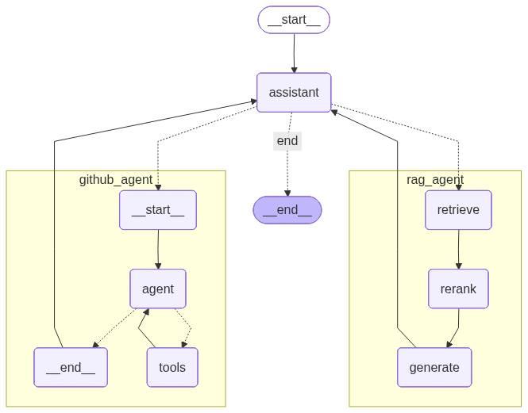

# Super Duper Chat Bot

A production-quality multi-agent assistant built with LangGraph, featuring hybrid RAG over a resume, GitHub repository exploration via MCP, and a streaming FastAPI layer — deployable to AWS Lambda.



---

## What It Does

Send a message to `/chat` and the supervisor routes it to the right agent:

| Query | Agent |
|-------|-------|
| "What repos do I have?" | `github_agent` — ReAct loop over GitHub MCP tools |
| "Summarize my resume" | `rag_agent` — Hybrid retrieval → rerank → generate |
| "Hi there" | `assistant` — Direct LLM answer, no subagent |

Every response streams as Server-Sent Events. Each SSE payload is a typed Pydantic model discriminated on `type`.

---

## Architecture

```
POST /chat
    │
    ▼
┌─────────────┐
│  assistant  │  LLM router (structured output) → routes or answers directly
└──────┬──────┘
       │
  ┌────┴─────┐
  ▼           ▼
┌──────────────────┐   ┌──────────────────────────────┐
│   github_agent   │   │          rag_agent            │
│  ┌────────────┐  │   │  retrieve → rerank → generate │
│  │ github_llm │  │   │  BM25 + ChromaDB + RRF        │
│  │     ↕      │  │   │  Cross-encoder reranking      │
│  │   tools    │  │   └──────────────────────────────┘
│  └────────────┘  │
│  GitHub via MCP  │
└──────────────────┘
       │
       ▼
┌─────────────┐
│   verifier  │  checks answer quality, retries once on clear failure
└─────────────┘
```

See [ARCHITECTURE.md](ARCHITECTURE.md) for the full design rationale and whiteboard-level walkthrough.

---

## SSE Event Schema

Every event is a discriminated union on `type`:

```json
{"type": "thread_id", "thread_id": "..."}
{"type": "token",     "content": "...", "node": "rag_agent"}
{"type": "latency",   "node": "rag_agent", "latency_ms": 3401}
{"type": "latency",   "node": "total",     "latency_ms": 5275}
{"type": "interrupt", "question": "...", "suggested_route": "github_agent"}
{"type": "error",     "message": "..."}
data: [DONE]
```

---

## Setup

### Prerequisites

- Python 3.10+
- Node.js 20+ (required for the GitHub MCP server)
- An OpenAI API key
- A GitHub personal access token (classic, `repo` scope)

### Install

```bash
pip install -e ".[dev]"
```

### Environment variables

Create a `.env` file:

```env
OPENAI_API_KEY=sk-...
GITHUB_TOKEN=ghp_...

# Optional — enables LangSmith tracing
LANGCHAIN_TRACING_V2=true
LANGCHAIN_API_KEY=lsv2_...
LANGCHAIN_PROJECT=super-duper-chat-bot
```

### Ingest the resume

Drop your resume PDF at `data/resume.pdf`, then build the vector + BM25 indexes:

```bash
python scripts/ingest_resume.py
```

This only needs to run once (or when the resume changes). It writes:
- `data/chroma_db/` — ChromaDB vector store
- `data/bm25_index.pkl` — BM25 keyword index

---

## Running Locally

```bash
uvicorn src.api:app --reload
```

### Example requests

```bash
# Resume question
curl -X POST http://localhost:8000/chat \
  -H "Content-Type: application/json" \
  -d '{"message": "Summarize my resume"}' \
  --no-buffer

# GitHub question
curl -X POST http://localhost:8000/chat \
  -H "Content-Type: application/json" \
  -d '{"message": "List my GitHub repos", "thread_id": "my-thread"}' \
  --no-buffer

# Continue the same thread
curl -X POST http://localhost:8000/chat \
  -H "Content-Type: application/json" \
  -d '{"message": "What is Sentinel?", "thread_id": "my-thread"}' \
  --no-buffer

# Cancel a pending interrupt
curl -X POST http://localhost:8000/chat/cancel \
  -H "Content-Type: application/json" \
  -d '{"thread_id": "my-thread"}'
```

---

## RAG Pipeline

```
PDF → adaptive chunking → ChromaDB (OpenAI embeddings) + BM25 index
                                        │
                              hybrid_retrieve (k=10)
                               BM25 + vector → RRF fusion
                                        │
                              cross-encoder rerank (top 4)
                                        │
                              GPT-4o grounded generation
```

- **Adaptive chunking**: larger chunks for experience/projects sections, smaller for education/skills
- **RRF fusion**: rewards chunks that rank highly in both BM25 and vector results
- **Cross-encoder reranking**: `ms-marco-MiniLM-L-6-v2` scores each (query, chunk) pair jointly for precision

---

## GitHub Agent

Uses the [GitHub MCP server](https://github.com/modelcontextprotocol/servers/tree/main/src/github) (`@modelcontextprotocol/server-github`) via stdio. The ReAct loop calls tools until it has enough information to answer — it always fetches the README when a repo has no description.

Requires Node.js and `GITHUB_TOKEN` in the environment.

---

## AWS Deployment

The app is wrapped with [Mangum](https://github.com/jordaneremieff/mangum) for Lambda compatibility.

```
API Gateway (HTTP API)
    └── Lambda Function (Python 3.12 + Node.js layer)
            └── Mangum → FastAPI → LangGraph
```

### Notes

- **API Gateway timeout**: 29 seconds. Sufficient for current response times (~5s). For longer chains, migrate to Lambda Response Streaming with `InvokeMode: RESPONSE_STREAM`.
- **Checkpointer**: `MemorySaver` persists conversation state across warm Lambda invocations. Swap for a DynamoDB or PostgreSQL checkpointer for true multi-instance persistence.
- **Node.js**: The GitHub MCP server requires Node.js. Use a custom Docker image based on `public.ecr.aws/lambda/python:3.12` with a Node.js 20 layer.

---

## Project Structure

```
src/
├── api.py                # FastAPI: /chat, /chat/cancel — SSE streaming
├── graph.py              # Wires supervisor + subgraphs + checkpointer
├── state.py              # Shared TypedDict state
├── config.py             # LLM + embeddings (cached)
├── lambda_handler.py     # Mangum adapter for AWS Lambda
├── agents/
│   ├── assistant.py      # Supervisor: routing, verification, direct answers
│   ├── github_agent.py   # ReAct subgraph via GitHub MCP
│   └── rag_agent.py      # retrieve → rerank → generate pipeline
└── rag/
    ├── ingest.py         # PDF → ChromaDB + BM25
    ├── retriever.py      # Hybrid BM25 + vector + RRF
    └── reranker.py       # Cross-encoder reranking (async, thread pool)

scripts/
└── ingest_resume.py      # One-time index builder

data/
├── resume.pdf            # Your resume (not committed)
├── chroma_db/            # Vector store (not committed)
└── bm25_index.pkl        # BM25 index (not committed)
```

---

## LangSmith Tracing

With `LANGCHAIN_TRACING_V2=true` set, every request produces a full trace in LangSmith showing per-node latency, token counts, and inputs/outputs — no code changes required. Latency is also emitted inline as SSE `latency` events.
